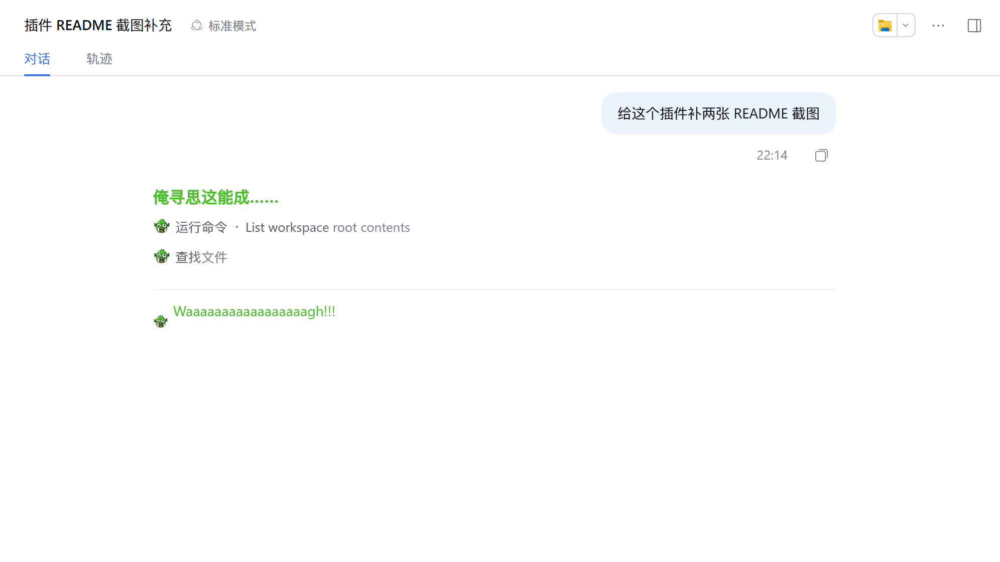
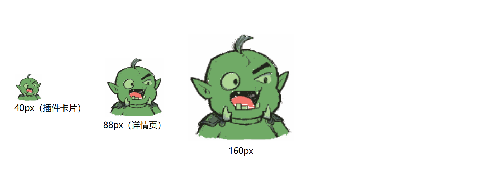
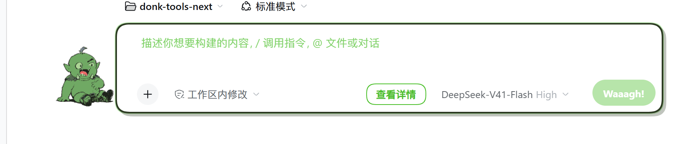
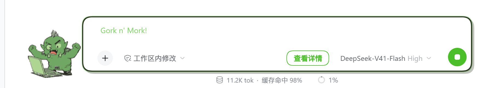
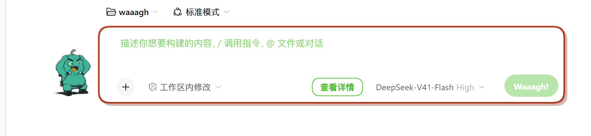
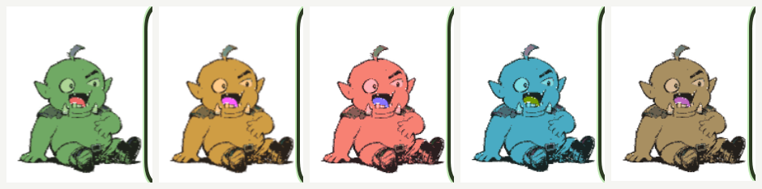

# dsh-waaagh-ork

WAAAGH! —— 给 DSH 加一个绿皮兽人，把写代码变成兽人式咆哮。

## 为什么做这个

用 AI 写代码的时候，感觉就像战锤里的绿皮兽人——「俺寻思」一下，代码就 WAAAAAGH 地冒出来了。所以做了这个插件：输入框旁边站一个**线条画风**的绿皮兽人（等着的时候坐地上挠肚子，模型干活时蹲在笔记本前狂敲键盘甩汗），模型思考/输出时都显示成绿色 `Waaaaaaagh!!!`（点一下看原文），连运行时的 `Deep diving...` 都换成了 `Waaaaaaagh!!!`。

插件**不碰输入框里的草稿**：你输入什么、发出去的就是什么，模型收到的永远是原文。

## 长啥样



插件自身（插件列表卡片 / 详情页）的图标由包清单的 **`icon` 字段**声明，内容是同一张奥尔克大头（`mascot.py --icon` 同时写出 PNG 和它内嵌的 SVG）：



| 等待时 | 干活时 |
| --- | --- |
|  |  |

失败时他会两手抱头惊慌，气泡同时转红；氏族配色只换肤色，线条画的墨线不受影响：

| 失败 | 五个氏族（Goffs / Bad Moons / Evil Sunz / Deathskulls / Snakebites）|
| --- | --- |
|  |  |

## 特性

- 绿色皮肤：输入框变成**漫画对话泡泡**（粗墨线 + 硬投影），主发送按钮是绿色 `Waaagh!` 药丸。
- 绿皮头像：**线条画风**的全身小兽人站在漫画泡泡**左侧的空白里**——尺寸和位置由 JS 按真实布局量出来的空白自适应（`z-index:40`，桌面版聊天列只有约 68px 空白，固定 122px 会钻到侧栏下面）。
- **只有三个动画**（待机 3 帧 + 干活 8 帧 + 惊慌 4 帧）：
  - **等待** = 一屁股坐在地上、挠着圆肚子傻笑，眨眼是"睁→半闭→闭"的眼皮滚动（5 秒一轮），**姿势固定不再轮换**。
  - **干活** = 蹲在**笔记本前拼命敲键盘**：两只手交替砸键盘、身体前倾凑近屏幕、嘴巴张大在吼、额头甩出汗珠；回合一开始就切过去，回答落地切回来，**全程原地不动**。
  - **失败** = **两手抱头惊慌失措**：工具调用或回合报错时接管动画 4.2 秒，同时**气泡边框转红**。判定挂在 `data-error` 上（新增节点与既有节点上加属性两种路径都监听），是**边沿触发**——错误行会一直留在聊天记录里，不能靠"屏幕上有没有错误"来判定。
- **氏族配色**（设置里选，localStorage 记忆）：同一套线条画，一次 `hue-rotate` 换肤色——**Goffs 绿 / Bad Moons 黄 / Evil Sunz 红 / Deathskulls 蓝 / Snakebites 褐 / Blood Axes 橄榄**。角度不是眼估的：实测雪碧图肤色在色相 **0.299**，每个氏族按 `(目标色相 − 0.299)` 算出来 ✔ 自定义头像不会被染色。
- **标题徽标**：干活时标签页/任务栏标题变成 `WAAAGH! · 原标题`，跑完摘掉；**如果完成时窗口不在前台，标题会闪 3 下**——最小化也能看出跑完了。DSH 自己会重写标题（会话名在流式过程中生成），所以前缀是每个 700ms 的 tick 重新打上的，而不是只打一次。
- **回合完成时喊一嗓子**：回答落地后 `WAAAGH` 在星形爆炸气泡里挂 2.6 秒。**点他一下也会喊**（纯装饰交互：`aria-hidden`、不进 tab 顺序、不会往输入框里写任何东西）。
- 输出遮罩：助手的过程与正文替换成绿色 `Waaaaaaagh!!!`——完成的回合是静态文字，流式回合是逐字生长的动画；点消息看原文，`查看详情` 按钮全局切换。
- 运行提示：`Deep diving...` / `深度求索中，用时 …` 变成绿色 `Waaaaaaagh!!!`，旁边那条鲸鱼尾巴换成会点头的绿皮头像（桌面版 0.2.0 的 `TextShimmer` 把标记从 `data-text-shimmer` 改成了 `data-shimmer`，所以按 `runningText` 类名兜底）。
- 过程行：`正在读取文件` / `准备写入文件` 这类 step-process 行，图标变成绿皮头像、文字变成每行随机嚎叫（点 `查看详情` 恢复原文）。
- 随机嚎叫：每个遮罩的 `a` 串长度都重新随机（`W` + 2~31 个 `a` + `gh` + 1~3 个 `!`）——每条消息一个、流式动画一个、运行提示与喊话气泡各一个。
- 兽人小动作（纯 CSS，`prefers-reduced-motion` 下全部关闭）：
  - 待机：绿皮呼吸式起伏 + 眨眼；输入框一开始有内容它就凑近、颜色更绿。
  - 运行中：整只兽人快速摇摆咆哮、带绿色辉光。
  - 发出消息：你自己的消息落到会话里时，它会吼一下（一次性 0.8s）。
  - 输出遮罩：每条遮罩弹入；流式时一边逐字生长一边左右晃。
  - 过程行：每个绿皮图标随行出现来一次「dakka」闪光，鼠标悬停时凑近。
  - 按钮：`Waaagh!` 药丸悬停鼓起、按下压扁；`查看详情` 按下回弹。
- 过程行图标：工具调用、上下文注入、压缩行的小图标换成绿皮头像（失败时保留红圈）。
- 自定义头像：设置 → 通用里可粘贴图片 URL 或 `data:image` 数据替换内置头像。

## 兼容性

| 运行形态 | DSH 版本 | 状态 |
| --- | --- | --- |
| `dsh web` / CLI（浏览器） | 0.1.6-alpha.2 及以上 | ✅ |
| DSH Desktop（Electron 桌面版，打包 0.2.0-rc.2 客户端） | 0.2.0-rc.2 | ✅ |

0.1.6 / 0.1.7 把输入框换成了 Lexical 富文本、把提交入口从插槽 action 移到了 composer 自己的键盘面、并把运行中提示从「可见的 live region」挪进了当前回合的过程行；0.2.0 又把 `TextShimmer` 的标记从 `data-text-shimmer` 换成 `data-shimmer`、并把文本挪进内层 span（所以运行行是按 `runningText` 类名兜底定位的）。插件已按这些变化改写，同时对老结构保留兼容分支。

## 安装

### Web 配置档

```sh
dsh plugin --profile web add dsh-waaagh-ork
```

然后重启 `dsh web`，刷新页面即可。

### 桌面版

桌面版使用 `~/.dsh/profiles/desktop` 配置档，由 Electron 应用独占管理：

- 推荐：在桌面版里打开 **设置 → 插件**，安装 `dsh-waaagh-ork`；
- 或手工把依赖写进 `~/.dsh/profiles/desktop/package.json`：

  ```json
  {
    "dependencies": { "dsh-waaagh-ork": "^0.2.0" },
    "dsh": { "profile": { "bundles": ["@deepseek-ai/dsh-base", "@deepseek-ai/dsh-web-app", "dsh-waaagh-ork"] } }
  }
  ```

  再用桌面版自带的 pnpm 安装，然后重启桌面版。

本地开发（两个配置档同理）：

```sh
dsh plugin --profile web add link:/path/to/dsh-waaagh-ork
```

> 桌面版/CLI 都是按这个 `link:` 直接读工作副本的——**移动或删除这个目录，插件就加载失败**。想固定住就把仓库放到一个长期不动的路径，或者改用 `file:` 装一份副本。

## 开发

源码在 `src/`，`lib/` 与 `src/assets/` 里的 PNG 都是**提交进仓库的生成产物**——DSH 在安装插件时不会构建任何东西，运行时直接读 `lib/client.js`，所以产物必须入库；但产物一律由生成器产出，不允许手改。

```sh
pnpm install          # 安装 esbuild / typescript 与 DSH 类型契约包
pnpm run typecheck    # tsc --noEmit，对真实 .d.ts 检查插槽名、props、选择器字段
pnpm run check-assets # 校验三张精灵图的尺寸/帧数契约（128×160 × 帧 / 图标 144×144）
pnpm run build        # src/ → lib/index.js（host）+ lib/client.js（浏览器半）
pnpm run verify       # = typecheck + check-assets + build，再校验 lib/ 没有漂移
pnpm run smoke        # 对运行中的实例做行为回归（见下），没给 URL 或没装 Playwright 就跳过
```

`pnpm run smoke` 需要 Playwright（**不是**本包依赖，避免顺带装浏览器）和一个跑着的实例：

```sh
DSH_SMOKE_URL='http://127.0.0.1:PORT/?token=...' pnpm run smoke
```

它断言的是**只有真跑起来才知道的事**：待机 3 帧坐姿、干活切 8 帧键盘、兽人不压住输入框、气泡没有多余尾巴、**草稿原样保留且原样送达**、干活时标题带徽标、点他会喊且不写草稿、报错时切惊慌动画且气泡转红、氏族存得住并真的染色、控制台零报错（共 19 项）。

**吉祥物是 AI 生成的**（`scripts/mascot.py`）：本机没有可用的国内生图 skill（小云雀要 `XYQ_ACCESS_KEY`，SpriteCook 要它自己的 MCP 服务端），但用户环境里已经有**火山方舟**凭据，于是走 `doubao-seedream-4-0` 的 `images/generations`：

```sh
# ARK_API_KEY / ARK_BASE_URL / VOLC_IMAGE_MODEL 从环境读取；密钥不会被打印
python scripts/mascot.py                       # 生成 12 帧 → 组装 2 条雪碧图 + 144×144 图标
python scripts/mascot.py --raw <dir> --icon    # 用已保存的原图重建，不再消耗额度（CI 走这条）
python scripts/mascot.py --style ref.png --prompts sheet.json   # 换画风：参考图 + 提示词表
python scripts/mascot.py --raw <新目录> --rebase <旧目录>         # 只改角色设计，保留姿势
```

> **原图没有进仓库**（体量大且在 `%TEMP%`），只有拼好的雪碧图是提交产物。要重新编辑某一帧时，
> 手上没有 `<dir>` 就只能重新生成；想长期保留就把 `--raw` 指到仓库外的固定目录。

**画风是"线条画"**：粗黑手绘线条、大量留白、极少平涂色，眼睛画得特别大、瞳孔是很小的黑点。做法上有三处工程处理，都是为了"看起来像一个人画的"：

| 处理 | 为什么 |
| --- | --- |
| 母版用参考图当**画风**输入，其余帧拿母版当**角色**参考 | 所有帧必须同一个人、同一个画风 |
| `--rebase <dir>`：拿**已保存的帧**逐帧原地重画 | 改**角色设计**时（例如"獠牙再大一点"）能保住已经调好的姿势。注意它对**整体构图**改动无效：当年把游泳帧改成新设计时，模型把"水淹到腰"改成了"站在小水洼里"，还给溺水帧自己画了个方框——那两套只能重新生成 |
| `--style <图>`：指定母版的画风参考 | 换画风时（例如"改成这种线条画"）把参考图直接喂给模型，比用文字描述准 |
| `apply_wash()`：把**偏绿**的像素一律拉 0.75 到统一奥尔克绿 | 模型上的绿浓淡差别很大（实测色相 0.34–0.58、亮度 0.2–0.9 都有），翻帧会闪色；判定用**色相+饱和度**而不是亮度（墨线是"又暗又中性"，所以不动），顺带把模型爱加的体积阴影压平，更贴近平涂线条画 |
| 整条雪碧图**统一缩放比例 + 统一脚底基线** | 逐帧独立缩放会让角色忽大忽小（剪影矮的帧被放大到填满画框）|
| 生成失败的**定向编辑** | 提示词里同时要求"喊"和"不要文字"时，模型会画音效字母（实测画出了 "AAA"/"GH"）。这时别重出整套（它还会再画一遍），改成逐帧原地编辑"把字母擦掉换成汗珠"最快 |

角色设计是"**凶一点的萌兽人**"：**又大又粗、比嘴还高、向外上翘的两颗獠牙**，**又粗又浓、向中间下斜的怒眉**（上眼睑被压住一点），宽下颚前突、扁塌宽鼻、尖长耳、莫西干呆毛、微微驼背脑袋前伸、宽肩长臂大手掌，配简单项圈/腰带/靴子/小护肩，皮肤是**饱和的奥尔克绿**；但身体保持**圆滚滚的三头身、肚子又圆又鼓**——**不要肌肉线条、不要渐变阴影**（写"壮实兽人"会出来健美壮汉，把萌和线条画风一起丢掉，所以提示词里直接点名这两种失败模式）。

角色一致性靠**参考图链**：第一帧作为后续每一帧的 `image` 输入，提示词里再强调一遍设计。原图统一画在**纯品红背景**上，`mascot.py` 按**色相**抠掉背景和投影（只按颜色距离抠会把投影留成粉色污渍），再裁到外接框、统一缩放、量化到 24 色。

| 文件 | 尺寸 | 内容 | 来源 |
| --- | --- | --- | --- |
| `ork-idle.png` | 128×160 ×3 帧 | 等待：坐在地上挠肚子傻笑 + 眨眼过渡帧 | `scripts/mascot.py`（AI 生成） |
| `ork-work.png` | 128×160 ×8 帧 | 干活：蹲在笔记本前拼命敲键盘、甩汗、张嘴吼，末尾两帧闭嘴专注 | 同上 |
| `ork-error.png` | 128×160 ×4 帧 | 失败：两手抱头惊慌、汗珠乱飞 | 同上 |
| `ork-open.png` | 144×144 | 16px 图标用的大头（工具行 / 运行行 / 过程行） | `mascot.py --icon`：**专门画的高对比头部**，不是从雪碧图里裁的 |


两套模组由 `<html>` 上的 **`data-waaagh-running=on`** 切换（回合开始就打上），CSS 里只换 `background-image` 和翻帧动画：**待机 3 帧 / 5 秒一轮**（眨眼滚动），**干活 8 帧 / 1.2 秒一轮，但节奏不均匀**——六帧敲击各占 9–10%，"喊""擦汗""专注"这几帧占 1.4–1.8 倍时长，长回合才不会变成节拍器。

多帧动画都拼成**竖直雪碧图**，CSS 只放一个 URL，用 `background-position` 走几步切帧。**原始帧（1024² 的 9 张）不在仓库里**（约 3MB），归档在维护者机器的 `D:\MacShare\waaagh-art\frames`（`WAAAGH_RAW_DIR` 指过去就能离线重建雪碧图，否则要重新花额度生成）。

| 路径 | 作用 |
| --- | --- |
| `src/client/index.ts` | 浏览器半：插槽注册、绿皮头像、输入/输出遮罩、运行提示 |
| `src/host/index.ts` | Node 半：有意的空实现，只为让 Loader 条目能激活 |
| `src/assets/*.png` | 精灵图（两条 AI 雪碧图 + 裁出来的图标），构建时内联成 data URL |
| `scripts/mascot.py` | AI 生成吉祥物：调火山方舟 doubao-seedream、抠品红背景、拼雪碧图、`--icon` 生成 16px 图标 |
| `assets/icon.svg` | 插件管理器用的图标（内嵌 144×144 PNG），由 `mascot.py --icon` 同步生成 |
| `scripts/check-assets.mjs` | 校验三张图的尺寸契约 + 图标字段与内嵌 PNG 一致 |
| `scripts/smoke.mjs` | 对运行中的实例做行为回归（切换、草稿不变、零报错） |
| `scripts/build.mjs` | esbuild 构建：host 出 ESM，浏览器半出「懒 CJS 工厂注册」包 |
| `lib/` | 构建产物，`lib/client.js` 由 `dsh-client-modules` 通过 `/plugins` 提供给页面 |

关于浏览器半的产物格式：DSH 以经典脚本方式加载每个插件的客户端包，脚本必须调用 `window.__ModuleLoader__.load({ id, factory })` 注册一个惰性 CJS 工厂，工厂体拿到的 `require` 是 shell 的冻结模块表（`react` 属于平台种子，必须保持 external）。这正是 `scripts/build.mjs` 用 banner/footer 包住 esbuild CJS 输出的原因。

类型不靠猜：`@deepseek-ai/dsh-client-*` 在 npm 上带 `lib/types/**/*.d.ts`，devDependencies 里按 **0.2.0-rc.2** 精确锁定后，插槽名（`SlotMap` 声明合并）、seat 的标准 props（`useInput`/`useSession`/`inputActions`）、`InputState` 字段都由编译器把关——写错 slot 名或字段名会直接编译失败。CI 跑 `pnpm run verify`（typecheck + check-assets + build + `git diff --exit-code -- lib`）和 `pnpm run smoke`；三张精灵图都是生成产物，所以只校验尺寸契约、不做字节漂移。

## License

MIT
